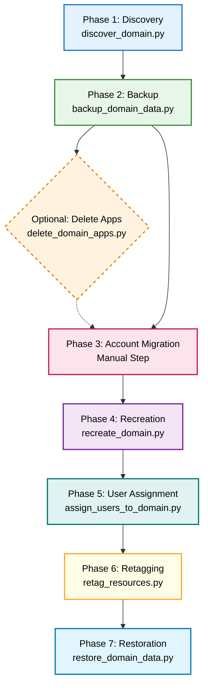

# SageMaker Studio Domain Migration Tool

A comprehensive Python-based tool for migrating Amazon SageMaker Studio domains between AWS Organizations. This tool automates the process of capturing domain configurations, backing up user data, recreating the domain in a new organizational context, and restoring all data and configurations.

## Table of Contents

- [Overview](#overview)
- [Prerequisites](#prerequisites)
- [Installation](#installation)
- [Migration Process](#migration-process)
- [Script Reference](#script-reference)
- [IAM Permissions](#iam-permissions)
- [Limitations](#limitations)
- [Troubleshooting](#troubleshooting)
- [Monitoring and Validation](#monitoring-and-validation)

## Additional Documentation

- [Script Reference](SCRIPT_REFERENCE.md) - Detailed documentation for each migration script
- [IAM Permissions](IAM_PERMISSIONS.md) - Detailed IAM policies and permissions required for each migration phase
- [Troubleshooting Guide](TROUBLESHOOTING.md) - Common issues, solutions, and debugging procedures

## Overview

When an AWS account moves between AWS Organizations, SSO-based SageMaker Studio domains break due to Identity Center instance changes. This tool provides an automated migration path by:

1. **Discovering** all domain configurations, user profiles, and spaces
2. **Backing up** user data from EBS volumes to S3
3. **Recreating** the domain and all resources in the new organizational context
4. **Assigning** users to the new domain via Identity Center
5. **Retagging** SageMaker resources to reference the new domain
6. **Restoring** user data from S3 back to the new domain

> [!IMPORTANT]
> This is not meant to be used in production scenarios. Use this repository as a starting point and to understand the migration process. Test it out in a dev/staging account first. Please work with your AWS team if you need support in migrating a Studio domain with active users.

## Key Features

- **Parallel Processing**: Apps are created in parallel with throttling to avoid API limits
- **Resume Functionality**: Resume domain recreation from existing domains if the script fails
- **Smart App Filtering**: Only processes InService apps, skips Failed/Deleted apps
- **Robust Error Handling**: Comprehensive status reporting and graceful failure handling
- **EFS Control**: Optional EFS data backup/restore for faster operations
- **Status Awareness**: Tracks and reports app states (InService, Failed, Deleted, etc.)
- **Resource Mapping**: Complete ARN mapping for seamless resource migration
- **Enhanced SSO Extraction**: Supports both simple and email-based user profile formats
- **Graceful Handling**: Manages existing resources during resume operations

## Prerequisites

### Software Requirements

- **Python**: Version 3.8 or higher
- **boto3**: AWS SDK for Python (install via `pip install boto3`)
- **AWS CLI**: Recommended for credential configuration

### AWS Requirements

- **AWS Credentials**: Configured with appropriate IAM permissions (see [IAM_PERMISSIONS.md](IAM_PERMISSIONS.md))
- **S3 Bucket**: An S3 bucket for storing backup data during migration
- **Identity Center**: Users must exist in the new Identity Center instance
- **Network Access**: VPC, subnets, and security groups must be accessible in the target account

### Supported Configurations

- **Authentication Mode**: SSO (Single Sign-On) mode only
- **App Types**: JupyterLab and CodeEditor
- **Storage**: Default EFS and EBS volumes only

## Installation

1. Clone or download this repository:
```bash
git clone <repository-url>
cd sm-domain-migration
```

2. Install required Python packages:
```bash
pip install -r requirements.txt
```

3. Configure AWS credentials:
```bash
aws configure
# Or use environment variables:
# export AWS_ACCESS_KEY_ID=your_access_key
# export AWS_SECRET_ACCESS_KEY=your_secret_key
# export AWS_DEFAULT_REGION=your_region
```

4. Create an S3 bucket for backups:
```bash
aws s3 mb s3://your-backup-bucket-name
```

## Migration Process Flow



## Migration Process

### Phase 1: Discovery

Capture all configuration details of the existing SageMaker Studio domain.

**Command:**
```bash
python scripts/discover_domain.py \
  --domain-id d-xxxxxxxxxxxx \
  --output-dir ./migration_data
```

**Parameters:**
- `--domain-id` (required): The ID of the existing SageMaker Studio domain
- `--output-dir` (optional): Directory to store configuration files (default: `./migration_data`)

**Output Files:**
- `migration_data/domain_config.json`: Domain configuration
- `migration_data/user_profiles.json`: User profile configurations
- `migration_data/spaces.json`: Space configurations

**Example:**
```bash
python scripts/discover_domain.py --domain-id d-abc123def456
```

### Phase 2: Backup

Sync user data from EBS volumes to S3 using lifecycle configurations.

**Command:**
```bash
python scripts/backup_domain_data.py \
  --domain-id d-xxxxxxxxxxxx \
  --s3-bucket your-backup-bucket \
  --s3-prefix sagemaker-migration \
  --config-dir ./migration_data \
  [--backup-efs] \
  [--no-backup-efs]
```

**Parameters:**
- `--domain-id` (required): The ID of the existing domain
- `--s3-bucket` (required): S3 bucket name for backup storage
- `--s3-prefix` (optional): S3 prefix for organizing backup data
- `--config-dir` (optional): Directory containing configuration files (default: `./migration_data`)
- `--backup-efs` (optional): Backup EFS data (default: True)
- `--no-backup-efs` (optional): Skip EFS data backup

**Output Files:**
- `migration_data/backup_status.json`: Backup operation status and any failures

**What This Does:**
1. Creates lifecycle configurations that sync data to S3
2. Attaches lifecycle configurations to the domain
3. Restarts all InService JupyterLab and CodeEditor apps (skips Failed, Deleted, or other non-InService apps)
4. Waits for apps to complete the backup process
5. Optionally excludes EFS data (`/home/sagemaker-user/user-default-efs`) if `--no-backup-efs` is specified

**Examples:**
```bash
# Backup with EFS data (default)
python scripts/backup_domain_data.py \
  --domain-id d-abc123def456 \
  --s3-bucket my-sagemaker-backups \
  --s3-prefix migration-2025-11

# Backup without EFS data
python scripts/backup_domain_data.py \
  --domain-id d-abc123def456 \
  --s3-bucket my-sagemaker-backups \
  --s3-prefix migration-2025-11 \
  --no-backup-efs
```

**⚠️ Important:** This phase will restart all active apps. Users will be temporarily disconnected.

### Optional: Delete Apps (Cost Savings)

After backing up data, you can optionally delete all JupyterLab and CodeEditor apps to save costs while the domain is not actively being used.

**Command:**
```bash
python scripts/delete_domain_apps.py \
  --domain-id d-xxxxxxxxxxxx \
  [--dry-run] \
  [--config-dir ./migration_data]
```

**Parameters:**
- `--domain-id` (required): The ID of the domain
- `--dry-run` (optional): Show what would be deleted without actually deleting
- `--config-dir` (optional): Directory for output files (default: `./migration_data`)

**Output Files:**
- `migration_data/deletion_status.json`: Deletion operation status

**What This Does:**
1. Lists all JupyterLab and CodeEditor apps in the domain
2. Deletes all apps (except those already in Deleted status)
3. Saves a status report of successful and failed deletions

**Example:**
```bash
# First, do a dry run to see what would be deleted
python scripts/delete_domain_apps.py --domain-id d-abc123def456 --dry-run

# Then actually delete the apps
python scripts/delete_domain_apps.py --domain-id d-abc123def456
```

**⚠️ Important:** 
- Apps will need to be manually restarted by users when they next access the domain
- This is useful for cost savings during the account migration period
- Always run with `--dry-run` first to verify what will be deleted

### Phase 3: Account Migration

**Manual Step:** Move your AWS account to the new AWS Organization using the AWS Organizations console or CLI. This step is performed outside of this tool.

### Phase 4: Recreation

Recreate the SageMaker Studio domain and all resources in the new organizational context.

**Command:**
```bash
python scripts/recreate_domain.py \
  --config-dir ./migration_data \
  --new-domain-name my-studio-domain-new
```

**Parameters:**
- `--config-dir` (optional): Directory containing configuration files (default: `./migration_data`)
- `--new-domain-name` (optional): Name for the new domain (default: original name with timestamp)
- `--resume-domain-id` (optional): Resume from existing domain ID instead of creating new domain

**Output Files:**
- `migration_data/recreation_mapping.json`: Mapping of old to new resource ARNs

**What This Does:**
1. Creates a new domain with the same configuration
2. Creates Identity Center application assignments for all users
3. Waits for automatic user profile creation
4. Updates user profile settings to match original configurations
5. Creates all spaces with original owners and settings
6. Generates a mapping file for ARN translation

**Examples:**
```bash
# Create new domain
python scripts/recreate_domain.py --new-domain-name studio-domain-prod

# Resume from existing domain (if script failed after domain creation)
python scripts/recreate_domain.py --resume-domain-id d-xyz789ghi012
```

**Resume Functionality:**
If the recreation script fails after creating the domain, you can resume from the existing domain instead of deleting and recreating it:
- Validates the domain exists and is accessible
- Skips domain creation and proceeds with user profiles and spaces
- Handles existing user profiles and spaces gracefully
- Still generates complete resource mapping

### Phase 5: User Assignment

Assign users to the new SageMaker Studio domain by creating Identity Center application assignments.

**Command:**
```bash
python scripts/assign_users_to_domain.py \
  --domain-id d-yyyyyyyyyyyy \
  --identity-store-id d-92679c0362 \
  --config-dir ./migration_data
```

**Parameters:**
- `--domain-id` (required): The ID of the new domain
- `--identity-store-id` (required): Identity Center identity store ID 
- `--config-dir` (optional): Directory containing configuration files (default: `./migration_data`)

**Output Files:**
- `migration_data/user_assignment_status.json`: User assignment operation status and any failures

**What This Does:**
1. Loads user profiles from the configuration files
2. Extracts SSO usernames from user profile names
3. Uses Identity Center get_user_id API to find users by username
4. Creates application assignments for each user using SSO Admin APIs
5. Provides detailed status reporting for successful and failed assignments

**Example:**
```bash
python scripts/assign_users_to_domain.py \
  --domain-id d-xyz789ghi012 \
  --identity-store-id d-92679c0362
```

**⚠️ Important:** 
- Users must exist in the new Identity Center instance before running this script
- The identity store ID can be found in the AWS Identity Center console
- This script should be run after domain recreation but before users attempt to access the domain
- This step can also be done manually via the console if needed

### Phase 6: Retagging

Update tags on SageMaker resources to reference the new domain.

**Command:**
```bash
python scripts/retag_resources.py \
  --config-dir ./migration_data \
  --old-domain-id d-xxxxxxxxxxxx \
  --new-domain-id d-yyyyyyyyyyyy
```

**Parameters:**
- `--config-dir` (optional): Directory containing configuration files (default: `./migration_data`)
- `--old-domain-id` (required): The ID of the original domain
- `--new-domain-id` (required): The ID of the new domain

**Output Files:**
- `migration_data/retagging_status.json`: Retagging operation status

**What This Does:**
1. Identifies all SageMaker jobs, pipelines, and endpoints tagged with the old domain
2. Updates tags to reference the new domain, user profiles, and spaces
3. Uses the ARN mapping to translate old ARNs to new ARNs

**Example:**
```bash
python scripts/retag_resources.py \
  --old-domain-id d-abc123def456 \
  --new-domain-id d-xyz789ghi012
```

### Phase 7: Restoration

Restore user data from S3 back to the new domain.

**Command:**
```bash
python scripts/restore_domain_data.py \
  --domain-id d-yyyyyyyyyyyy \
  --s3-bucket your-backup-bucket \
  --s3-prefix sagemaker-migration \
  --config-dir ./migration_data \
  [--backup-efs] \
  [--no-backup-efs]
```

**Parameters:**
- `--domain-id` (required): The ID of the new domain
- `--s3-bucket` (required): S3 bucket name containing backup data
- `--s3-prefix` (optional): S3 prefix where backup data is stored
- `--config-dir` (optional): Directory containing configuration files (default: `./migration_data`)
- `--backup-efs` (optional): EFS data was backed up (default: True)
- `--no-backup-efs` (optional): EFS data was not backed up

**Output Files:**
- `migration_data/restoration_status.json`: Restoration operation status and any failures

**What This Does:**
1. Creates lifecycle configurations that sync data from S3
2. Attaches lifecycle configurations to the new domain
3. Starts apps for all spaces in parallel to trigger data restoration
4. Waits for apps to complete the restoration process
5. Skips restoring EFS data if `--no-backup-efs` is specified (must match backup settings)

**Examples:**
```bash
# Restore with EFS data (default)
python scripts/restore_domain_data.py \
  --domain-id d-xyz789ghi012 \
  --s3-bucket my-sagemaker-backups \
  --s3-prefix migration-2025-11

# Restore without EFS data (if backup was done with --no-backup-efs)
python scripts/restore_domain_data.py \
  --domain-id d-xyz789ghi012 \
  --s3-bucket my-sagemaker-backups \
  --s3-prefix migration-2025-11 \
  --no-backup-efs
```

## Script Reference

For detailed information about each script, including usage, features, parameters, and required IAM permissions, see [SCRIPT_REFERENCE.md](SCRIPT_REFERENCE.md).

## IAM Permissions

The migration process requires specific IAM permissions for each phase. For detailed information about required permissions, including phase-specific policies and a consolidated policy, see [IAM_PERMISSIONS.md](IAM_PERMISSIONS.md).

## Limitations

### Unsupported Application Types

This migration tool **does not support** the following SageMaker Studio application types:

- **Canvas Applications**: SageMaker Canvas apps are not supported and will not be migrated
- **Data Wrangler Applications**: Data Wrangler apps are not supported and will not be migrated
- **RStudio Applications**: RStudio apps are not supported and will not be migrated

**Workaround:** These applications must be manually recreated in the new domain after migration.

### Unsupported Storage Configurations

- **Custom File Systems**: Only default EFS volumes are supported. Custom file systems attached to the domain are not migrated
- **Large EFS Volumes**: EFS volumes containing multiple gigabytes of data may cause S3 sync failures in lifecycle configurations due to the 5-minute execution time limit

**Workaround for Large Volumes:**
- Use AWS DataSync for large data transfers
- Use EFS-to-EFS replication
- Manually copy data using EC2 instances with EFS mounted

### Other Limitations

- **Authentication Mode**: Only SSO (Single Sign-On) mode is supported. IAM mode domains are not supported
- **Identity Center Requirement**: User identities must exist in the new Identity Center instance before recreation
- **Manual Organization Migration**: The AWS account must be manually moved between organizations
- **Lifecycle Configuration Timeout**: Startup scripts have a 5-minute execution limit, which may not be sufficient for very large data volumes

## Troubleshooting

For detailed troubleshooting information, including common issues, solutions, debugging steps, and recovery procedures, see [TROUBLESHOOTING.md](TROUBLESHOOTING.md).

## Monitoring and Validation

### During Migration

Monitor the migration process by:

1. **Checking Status Files**: Each script generates a status JSON file in the `migration_data` directory
   ```bash
   cat migration_data/backup_status.json
   cat migration_data/recreation_mapping.json
   cat migration_data/retagging_status.json
   cat migration_data/restoration_status.json
   ```

2. **Monitoring AWS Console**: Watch the SageMaker console for:
   - Domain creation progress
   - User profile creation
   - Space creation
   - App status changes

3. **Checking CloudWatch Logs**: Monitor lifecycle configuration execution
   ```bash
   aws logs tail /aws/sagemaker/studio/lifecycle-config --follow
   ```

### Post-Migration Validation

After completing the migration, validate the new domain:

#### 1. Verify Domain Configuration
```bash
aws sagemaker describe-domain --domain-id d-yyyyyyyyyyyy
```

Check that:
- VPC, subnets, and security groups match the original
- Lifecycle configurations are attached
- Custom images are registered

#### 2. Verify User Profiles
```bash
aws sagemaker list-user-profiles --domain-id d-yyyyyyyyyyyy
```

Check that:
- All user profiles exist
- Execution roles are correct
- User settings match the original

#### 3. Verify Spaces
```bash
aws sagemaker list-spaces --domain-id d-yyyyyyyyyyyy
```

Check that:
- All spaces exist
- Owners are correct
- Sharing settings match the original

#### 4. Verify Data Restoration

Have users log in to SageMaker Studio and verify:
- All files and directories are present
- File permissions are correct
- No data corruption occurred

#### 5. Verify Resource Tags
```bash
# Check a training job
aws sagemaker describe-training-job --training-job-name <job-name>

# Check an endpoint
aws sagemaker describe-endpoint --endpoint-name <endpoint-name>
```

Verify that tags reference the new domain ID and ARNs.

#### 6. Test Functionality

Perform basic functionality tests:
- Start a JupyterLab app
- Create a new notebook
- Run a simple training job
- Access existing endpoints

### Rollback Considerations

- **Before Recreation**: The original domain still exists; no rollback needed
- **After Recreation**: Both domains exist temporarily; you can revert to the original if issues are found
- **After Deletion**: No automated rollback; rely on S3 backups for data recovery

**Best Practice:** Keep the original domain for at least 7 days after successful migration to ensure all functionality is working correctly in the new domain.

## Best Practices

1. **Test First**: Always test the migration process in a non-production environment before migrating production domains
2. **Communicate**: Notify users before starting the migration, especially during backup and restoration phases when apps will be restarted
3. **Backup Verification**: After the backup phase, verify that data exists in S3 before deleting the original domain
4. **Incremental Validation**: Validate each phase before proceeding to the next
5. **Keep Logs**: Save all script output and status files for troubleshooting
6. **Monitor Costs**: Be aware of S3 storage costs for backups and data transfer costs
7. **Clean Up**: After successful migration and validation, clean up S3 backups and delete the old domain to avoid unnecessary costs

## Support

For issues, questions, or contributions, please refer to the project repository or contact your AWS support team.
